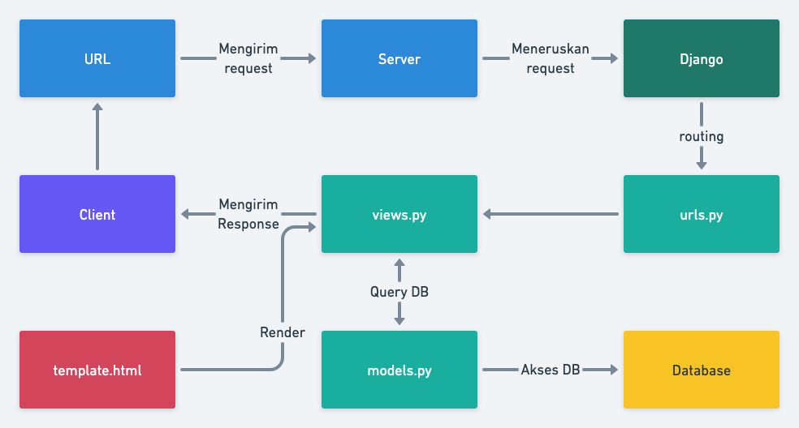

# Tugas 2: Pengenalan Aplikasi Django dan Models View Template (MVT) pada Django

Pemrograman Berbasis Platform (CSGE602022) - diselenggarakan oleh Fakultas Ilmu Komputer Universitas Indonesia, Semester Ganjil 2022/2023

## HerokuApp Link

[https://katalogku.herokuapp.com/katalog/](https://katalogku.herokuapp.com/katalog/)

## Bagan

Client mengirimkan request ke server dan server meneruskannya ke Django. Kemudian, Django parsing URL yang diterima untuk diteruskan ke views. Lalu, views melakukan query ke database melalui models. Setelah itu, views me-render HTML dari template dan mengirimkannya kepada client sebgai response.

## Virtual Environment

Penggunaan virtual environment dalam mengembangkan suatu aplikasi web digunakan untuk menjaga dependensi yang dibutuhkan sehingga tidak terjadi konflik. Pengembangan web bisa saja tidak menggunakan virtual environment, tetapi dependensi yang diperlukan harus tersedia dan adanya resiko terjadinya konflik jika mengembangan lebih dari satu web. 

## Implementasi

1. Membuat sebuah fungsi pada views.py yang dapat melakukan pengambilan data dari model dan dikembalikan ke dalam sebuah HTML.
   > Fungsi yang dibuat adalah show_catalog(request). Fungsi tersebut mengambil semua data dari model. Data tersebut di-render ke template HTML.
2. Membuat sebuah routing untuk memetakan fungsi yang telah kamu buat pada views.py.
   > Fungsi sebelumnya di-import, lalu didefiniskan pada list urlpatterns.
3. Memetakan data yang didapatkan ke dalam HTML dengan sintaks dari Django untuk pemetaan data template.
   > Melakukan iterasi terhadap data yang sudah diberikan untuk ditampilkan ke dalam bentuk tabel.
4. Melakukan deployment ke Heroku terhadap aplikasi yang sudah kamu buat sehingga nantinya dapat diakses oleh teman-temanmu melalui Internet.
   > Menambahkan HEROKU_API_KEY dan HEROKU_APP_NAME pada secrets Github.