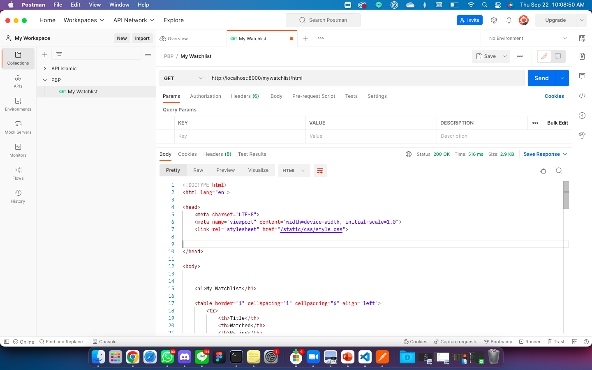

# Tugas 3: Pengimplementasian Data Delivery Menggunakan Django

Pemrograman Berbasis Platform (CSGE602022) - diselenggarakan oleh Fakultas Ilmu Komputer Universitas Indonesia, Semester Ganjil 2022/2023

## HerokuApp Link
[Dalam format HTML </br>](https://katalogku.herokuapp.com/mywatchlist/html)
[Dalam format XML </br>](https://katalogku.herokuapp.com/mywatchlist/xml)
[Dalam format JSON](https://katalogku.herokuapp.com/mywatchlist/json)

## HTML vs XML vs JSON
- JSON lebih ringan dibandingkan dengan HTML dan XML
- HTML dan XML termasuk markup language. Sedangkan JSON hanya notasi dari sebuah objek.
- JSON diakses dengan sebuah key. Sedangkan, HTML dan XML bisa diakses dengan DOM.
- HTML menampilkan dokumen pada browser. Sedangkan JSON dan XML hanya digunakan untuk menyimpan data 

## Data Delivery
Dalam mengimplementasikan sebuat platform, data delivery dibutuhkan agar aplikasi bisa memuat data yang paling baru dari data yang tersedia pada server.

## Implementasi
1. Membuat suatu aplikasi baru bernama mywatchlist di proyek Django Tugas 2 pekan lalu
    - Menjalankan perintah `python manage.py startapp mywatchlist`
    - Menambahkan `"mywatchlist"` pada list `INSTALLED_APPS` pada file settings.py  
2. Menambahkan path mywatchlist sehingga pengguna dapat mengakses http://localhost:8000/mywatchlist
    - Menambahkan `path('mywatchlist/', include('mywatchlist.urls'))` pada list `urlpatterns` pada file urls.py (project_django)
    - Menambahkan 
        ```
        path('html', show_html, name='html'),
        path('xml', show_xml, name='xml'),
        path('json', show_json, name='json'),
        ```
        pada list `urlpatterns` pada file urls.py (mywatchlist)
3. Membuat sebuah model MyWatchList
    - Membuat class model MyWatchlist dengan field sebagai berikut
        ```
        watched = models.BooleanField()
        title = models.CharField(max_length=255)
        rating = models.IntegerField()
        release_date = models.DateField()
        review = models.TextField()
        ```
4. Menambahkan minimal 10 data untuk objek MyWatchList yang sudah dibuat di atas
    - Membuat folder fixtures dan menambahkan data `initial_mywatchlist_data.json`
5. Mengimplementasikan sebuah fitur untuk menyajikan data yang telah dibuat sebelumnya dalam format HTML, XML, dan JSON
    - Membuat function `show_html()` dengan return function `render()`
    - Membuat function `show_xml()` dengan return function `HttpResponse()` dan parameter `content_type="application/xml"`
    - Membuat function `show_json()` dengan return function `HttpResponse()` dan parameter `content_type="application/json"`
6. Membuat routing sehingga data di atas dapat diakses melalui URL
    - Menambahkan 
        ```
        path('html', show_html, name='html'),
        path('xml', show_xml, name='xml'),
        path('json', show_json, name='json'),
        ```
        pada list `urlpatterns` pada file urls.py (mywatchlist)
     
7. Melakukan deployment ke Heroku terhadap aplikasi yang sudah kamu buat sehingga nantinya dapat diakses oleh teman-temanmu melalui Internet.
    - Push github saja:)
    - Pastikan telah menjalanakan `python manage.py migrate` dan `python manage.py makemigrations`
    - Tambahkan `python manage.py loaddata initial_mywatchlist_data.json` pada Procfile


## Screenshot Postman
### GET HTML


### GET XML


### GET JSON
